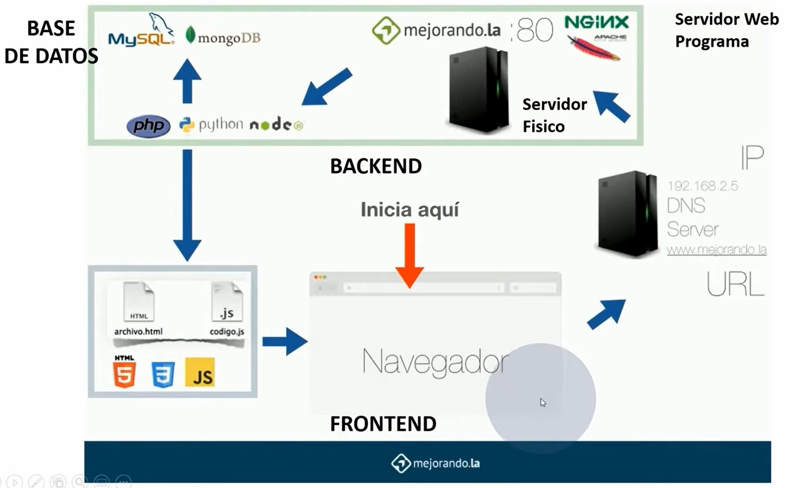
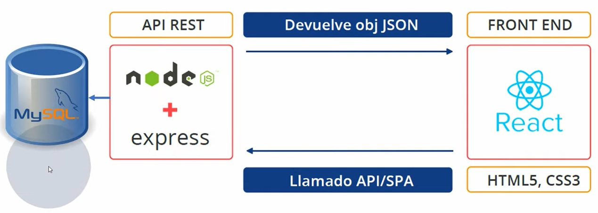

# ForzaSoft 🚀

Proyecto oficial de desarrollo de software

# Objetivos 🎯

Se propone analizar, diseñar y construir una aplicación software que permita controlar las ventas físicas y virtuales de una empresa de manufactura y hacerles el correspondiente seguimiento.

## Autores ✒️

_ScrumTeam_

- **Cristian Alberto Ariza Garcia**: - _Desarrollador_ - [cristeng](https://github.com/cristeng)
- **James Nebardo Mosquera Narvaez**: - _Analista_ - [yamcok1](https://github.com/yamcok1)
- **José De Jesús Barajas Sotelo**: - _Product Owner_ - [jdbarajass](https://github.com/jdbarajass)
- **Jairo Enrique Aquite Ramirez**: - _Administrador BD_ - [jaquite](https://github.com/jaquite)
- **Luis Fernando Yepes Molina**: - _Scrum Master_ - [luisfer-2019](https://github.com/luisfer-2019)

## Construido con 🛠️

_las herramientas usadas para crear el proyecto_

- [React JS](https://es.reactjs.org/)
- [HTML 5 ](http://html5.com/)
- [CSS3 ](http://www.css3.com/)
- [Lenguaje JavaScript ]()
- [Lenguaje TypeScript ]()
- [Java ]()
- [Node Js]()
- [Plataformas de desarrollo para Backend (Node JS)]()
- [Stack MEAN / MERN]()
- [JWT / Oatuh 2]()
- [Heroku]()
- [Git / GitHub]()

# Descripción desarrolladores 📑:

- **Cristian Alberto Ariza Garcia**:

- **James Nebardo Mosquera Narvaez**:

- **José De Jesús Barajas Sotelo**: ¡Hola! Soy estudiante desarrollador joven colombiano. Decidí involucrarme en el mundo de la tecnología con mi carrera como Ing. en control y automatización, ya que me fascina y es la trayectoria que sigue el mundo. Tengo conocimientos en electrónica, instrumentación, automatización y control; manejo lenguajes de programación como C++, Java, Labview, JavaScript, Python, Matlab, R studio, entre otros.

- **Jairo Enrique Aquite Ramirez**:

- **Luis Fernando Yepes Molina**:

## Licencia 📄

Este proyecto está bajo la Licencia (MIT LICENSE) - mira el archivo [LICENSE.md](https://github.com/hubotio/hubot/blob/master/LICENSE.md) para detalles

- ## Diagrama de funcionamiento de un sitio Web 🛠️👩‍💻👨‍💻

- ## Arquitectura final del proyecto 🛠️

